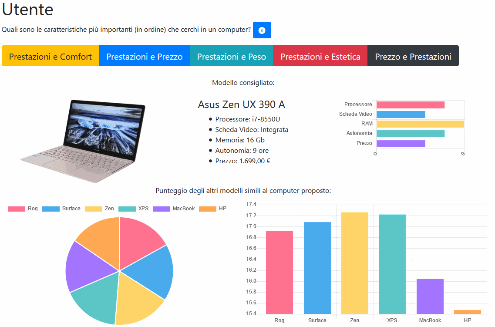
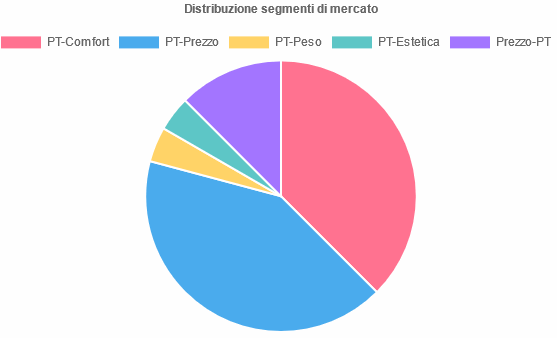
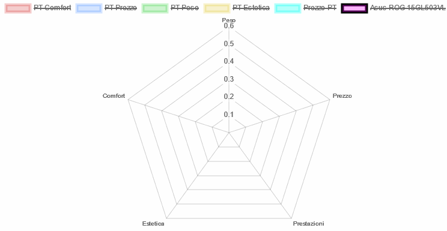

# Laptop-Evaluator
Developed in 4 days for a university project, this system is a one page application designed to choose which laptop a client wants to buy and evaluates it.

You can try it [**HERE**](https://www.informatica-unina.com/economia/) (no registration is required).
The software is written using *HTML5*, *Bootstrap* and *JQuery*.

It provides 3 interfaces:
* the **client** interface lets you choose the market segment you belong to (data is obtained from a market study) and finds the most suitable computer for you from the database;
* the **design** interface lets you evaluate laptops using [fuzzy logic](https://en.wikipedia.org/wiki/Fuzzy_logic); this evaluation is used to compute each laptop's final score;
* the **marketing** interface lets you compare a single laptop to all the identified market segments' needs in order to know wich aspect to improve.

Developed with @snipershady

## Screenshots
### Client interface

### Marketing interface

